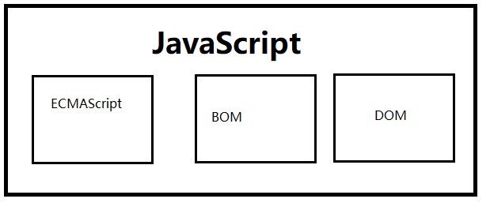

# JavaScript 基础


## 第一课  

> 学习目标：  
> 1. JavaScript介绍 
> 2. JavaScript的变量  
> 3. JavaScript数据类型 


### 网页、网站和应用程序

> 网页： 单独的一个页面  
> 网站： 一些相关的网页组成在一起，就变成了网站  
> 应用程序： 可以和用户产生交互，并且实现某种功能  
>     使用web技术也可以用来做应用程序（百度脑图演示）


### JavaScript能做啥？
1. [impressJS](https://impress.js.org/#/step-2)
2. [百度脑图](http://naotu.baidu.com/)
3. [极客战记](https://codecombat.163.com/play)


### JavaScript介绍

#### JavaScript是什么

它最初由Netscape的Brendan Eich设计。Netscape在最初将其脚本语言命名为LiveScript，后来Netscape在与Sun合作之后将其改名为JavaScript。JavaScript最初受Java启发而开始设计的，目的之一就是“看上去像Java”，因此语法上有类似之处，一些名称和命名规范也借自Java。JavaScript与Java名称上的近似，是当时Netscape为了营销考虑与Sun微系统达成协议的结果。为了取得技术优势，微软推出了JScript来迎战JavaScript的脚本语言。为了互用性，ECMA国际创建了ECMA-262标准（ECMAScript）。两者都属于ECMAScript的实现。

> JavaScript 是一种运行在**客户端**的*脚本语言*  
> JavaScript 的解释器称为JavaScript引擎，为浏览器的一部分，广泛用于客户端的脚本语言。

#### JavaScript最初的目的
  为了减少网络请求响应时间，在客户端进行表单验证。


#### JavaScript的目前的应用场景
JavaScript 无所不能

1. 网页特效
2. 服务端开发([Node.js](https://nodejs.org))
3. 命令行工具（[Node.js](https://nodejs.org)）
4. 桌面应用（[Electron](https://electronjs.org/)）
5. App([Cordova](https://cordova.apache.org/))
6. 硬件控制-物联网（[Ruff](https://ruff.io/)）
7. 游戏开发（[Cocos2d-JS](https://www.cocos.com/docs/js/)）  
etc.

#### JavaScript 与 HTML、CSS的区别

1. HTML 提供网页结构，提供网页中的内容
2. CSS 用于美化页面
3. JavaScript 用来控制页面内容，给页面增加动态效果

#### JavaScript的组成


- ECMAScript  
ECMA 欧洲计算机联合会

定义了JavaScript的语法规范。它是JavaScript的核心，描述了语言的基本语法和数据类型，ECMAScirpt是一套标准，定义了语言的标准，与具体的实现是无关的。

- BOM - 浏览器模型对象
一套操作浏览器功能的API，比如 弹出框、控制浏览器跳转，获取分辨率等等

- DOM - 文档对象模型
一套操作页面的API，把HTML看成是一个文档树，通过DOM的API可以对树上的节点进行操作。


### JavaScript初体验
css书写位置  

js书写位置   


- 行内JS
- 内部JS
- 外部js
> 不能在引入外部js的同时，书写内部js代码


### 变量

#### 什么是变量
- 变量是计算机内存中存储数据的标识符，根据变量名称可以取得内存中存储的数据
- 为什么要使用变量
    + 使用变量可以方便获取或者修改内存中的数据

#### 如何使用变量
- var 声明变量
```javascript
var age;
```
- 变量赋值
```javascript
var age;
age = 10;
```
- 变量的初始化

```javascript
// 在声明的同时赋值 --- 变量的初始化
var age = 10;
```


- 同时声明多个变量
```javascript
var age, name, sex;
age = 10;
name = '张三';
```

- 同时声明多个变量并赋值
```javascript
var age = 18,name = '张三',sex = '男';
console.log(age, name, sex);
```

#### 变量的命名规则和规范

- 规则 - 必须遵守，不遵守就会报错
   - 由字母、数字、下划线、$符号组成，不能以数字开头
   - 不能是关键字和保留字，例如： for  while 等等
   - 区分大小写
- 规范 - 建议遵守，不遵守也不会报错
   - 变量名要有意义
   - 驼峰命名法。 首字母小写，后边单词的首字母大写。 `userName`


 ### 数据类型
 #### 简单数据类型

 Number、String、Boolean、undefined、null

#### 字面量

 数值固定值的表示方法

8，9，10，'张三',false ,true

 #### Number类型
 - 进制
 ```javascript
// 十进制
    var num = 9;
    // 在计算机中，存储的时候都是2进制，但是在计算中，一般都转换成10进制
// 其它进制表示方法

// 十六进制
var num = 0xA;

// 八进制
var num = 07;
 ```
- 浮点数
```javascript
// 因为存储的都是2进制，所以 浮点数会存在精度问题
// 永远不要用 浮动数去做比较
```

- 数值的取值范围
```javascript
// 最大值：
Number.MAX_VALUE
// 最小值：
Number.MIN_VALUE
//无穷大：
Infinity
// 负无穷
-Infinity
```
- 数值判断
    + NaN   not a number 不是一个数字
        * NaN 与任何职都不相等，包括他本身
    + isNaN()  用来判断是不是一个数字

 #### String类型
 - 字符串字面量

   '程序员','咕泡学院'

- 如何打印一下字符串
  - 我是一个"正直"的人
  - 我很喜欢"咕泡'学院'"

 - 转义字符

| 字面量 | 含义 |
| :----: | ---- |
|   \n   | 换行 |
|   \t   | 制表 |
|  等等  |      |

 - 获取字符串长度

    msg.length

 - 字符串拼接

    'hello' + 'world'

    
#### Boolean类型
- 字面量  true,false
- 计算机内部，1为true,0为false

#### undefined和null
1. undefiend 表示一个变量声明了，但是没有赋值
2. null表示 变量内容为null,必须通过手动设置。
   
   
#### 获取变量的类型
  typeof  用于获取变量的类型。

#### 注释
```javascript
// 单行注释

/*
多行注释

多行注释 一般用于描述 整个文档，或者描述某个函数

**/


```

### 数据类型转换

使用谷歌浏览器，查看数据类型打印的样式
字符串是 黑色，数值类型和布尔类型 是蓝色 ，undefined和null 是灰色

#### 转换成字符串
- toString()方法
- String() 方法
- 通过字符串拼接的方法

#### 转换成数值类型
- Number() 强制类型转换
    + 只要字符串中包含字母，就是NaN
    + 布尔类型转换成 0 或 1
- parseInt() 转换成整数
    + 非数字 是 NaN
    + 布尔类型 是 NaN
    + 数字开头的字符串是 数字
    + 字母开头的字符串 是字母
- parseFloat() 转换成浮点数
    + 与parseInt非常类似
    + 解析第一个 . ，遇到第二个. 或者 非数字结束
    + 如果解析的内容只有整数，那么就返回整数
- 取正数 或者 负数 或者 - 0 运算  
    + 隐式转换
    + 如果带有非数字就是NaN
    + 能转换布尔类型
    + 注意不能 使用+ ,此时是 字符串拼接符
    
    
#### 转换成布尔类型
只有Boolean() 强制类型转换

转换成false 的情况
- null
- undefined
- ''
- 0
- NaN
  其它情况都是true

### 作业

- 交换两个变量的值

  ```javascript
  //  交换两个变量的值
  var num1 = 5;
  var num2 = 6;
  
  // 思考：
  // 有几种方法？
  ```

  

