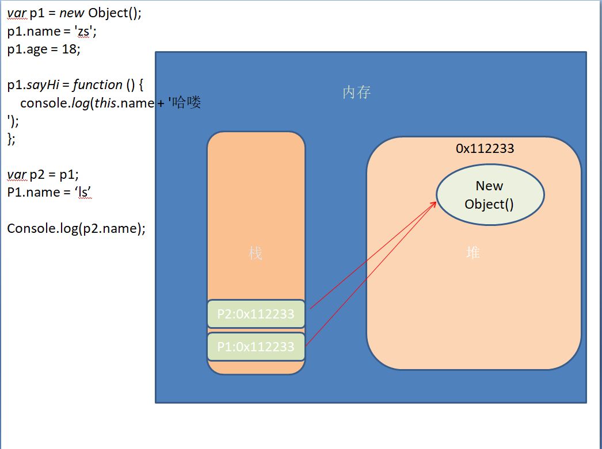

# JavaScript 基础

## 第四课

### 作用域

作用域：变量可以起作用的范围

#### 全局变量和局部变量

- 全局变量

  在任何地方都可以访问到的变量就是全局变量，对应全局作用域

- 局部变量

  只在固定的代码片段内可访问到的变量，最常见的例如函数内部。对应局部作用域(函数作用域)

> 1. 不使用var声明的变量是全局变量，不推荐使用。
> 2. 变量退出作用域之后会销毁，全局变量关闭网页或浏览器才会销毁

#### 块级作用域

任何一对花括号（｛和｝）中的语句集都属于一个块，在这之中定义的所有变量在代码块外都是不可见的，我们称之为块级作用域。

>  **在es5之前没有块级作用域的的概念,只有函数作用域**，现阶段可以认为JavaScript没有块级作用域

#### 作用域链

> 1. 在ECMAScript中，只有函数可以制造局部作用域结构。 那么只要是代码，就至少有一个作用域, 即全局作用域。
> 2. 凡是代码中有函数，那么这个函数就构成另一个作用域。
> 3. 如果函数中还有函数，那么在这个作用域中就又可以诞生一个作用域。
> 4. 将这样的所有的作用域列出来，可以有一个结构: 函数内指向函数外的链式结构。就称作**作用域链**。

### 对象

#### 为什么要有对象

```javascript
function printPerson(name, age, sex....) {
}
// 函数的参数如果特别多的话，可以使用对象简化
function printPerson(person) {
  console.log(person.name);
  ……
}
```

#### 什么是对象

> 现实生活中：万物皆对象，对象是一个具体的事物，一个具体的事物就会有行为和特征。
>
> 举例： 一部车，一个手机
>
> 车是一类事物，门口停的那辆车才是对象
> 	特征：红色、四个轮子
> 	行为：驾驶、刹车

#### JavaScript中的对象

> JavaScript中的对象其实就是生活中对象的一个抽象
>
> JavaScript的对象是无序属性的集合。
>
> ​	其属性可以包含基本值、对象或函数。对象就是一组没有顺序的值。我们可以把JavaScript中的对象想象成键值对，其中值可以是数据和函数。
>
> 对象的行为和特征
> 	特征---属性
> 	行为---方法

- 事物的特征在对象中用属性来表示。
- 事物的行为在对象中用方法来表示。

#### 对象字面量

```javascript
var o = {
  name: 'zs,
  age: 18,
  sex: true,
  sayHi: function () {
    console.log(this.name);
  }
};
```

思考：

> 如何把学生对象、老师对象、英雄对象改写成字面量的方式

#### 对象创建方式

##### 对象字面量

> 通过字面量创建对象

##### new方法创建对象

```javascript
var person = new Object();
  person.name = 'lisi';
  person.age = 35;
  person.job = 'actor';
  person.sayHi = function(){
  console.log('Hello,everyBody');
}
```

##### 工厂函数创建对象

```javascript
function createPerson(name, age, job) {
  var person = new Object();
  person.name = name;
  person.age = age;
  person.job = job;
  person.sayHi = function(){
    console.log('Hello,everyBody');
  }
  return person;
}
var p1 = createPerson('张三', 22, 'actor');
```

#### 属性和方法

> 1. 如果一个变量属于一个对象所有，那么该变量就可以称之为该对象的一个属性，属性一般是名词，用来描述事物的特征
> 2. 如果一个函数属于一个对象所有，那么该函数就可以称之为该对象的一个方法，方法是动词，描述事物的行为和功能

#### 对象的使用

##### 遍历对象的属性

> 通过 for ... in可以遍历一个对象

```javascript
var obj = {};
for (var i = 0; i < 10; i++) {
  obj[i] = i * 2;
}
for(var key in obj) {
  console.log(key + "==" + obj[key]);
}
```

##### 删除对象的属性

```javascript
var obj = {
    name: 'mm'
}; 
console.log(obj.name); // mm 
delete obj.name;
console.log(obj.name); // undefined
```

### 简单类型和复杂类型

> 简单数据类型，又叫基本类型，值类型
>
> 复杂数据类型，又叫 引用类型。
>
> 值类型：简单数据类型，基本数据类型，在存储时，变量中存储的是值本身，因此叫做值类型。
>
> 引用类型：复杂数据类型，在存储是，变量中存储的仅仅是地址（引用），因此叫做引用数据类型。

#### 栈和堆

> 堆栈空间分配区别：
>
> 1. 栈（操作系统）：由操作系统自动分配释放 ，存放函数的参数值，局部变量的值等。其操作方式类似于数据结构中的栈；
> 2. 堆（操作系统）： 存储复杂类型(对象)，一般由程序员分配释放， 若程序员不释放，由垃圾回收机制回收，分配方式倒是类似于链表。

注意：JavaScript中没有堆和栈的概念，此处我们用堆和栈来讲解，目的方便理解和方便以后的学习。


#### 基本类型在内存中


#### 复杂类型在内存中



#### 基本类型作为参数


#### 复杂类型作为参数


